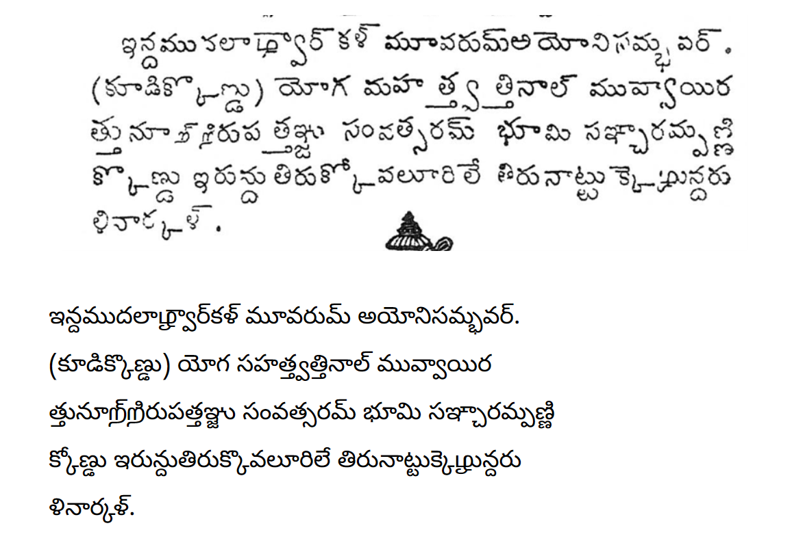

# Aazhvaar Telugu

Unicode font for the variant of the Telugu script used by the Shrivaishnavas to write religous Tamil texts. The font uses Tamil-style glyphs to represent the Tamil phonemes /ḻ/ & / ṟ/.  As a liturgical language, Tamil texts are frequently expressed in the Telugu script for reading and recitation by Telugu speakers.

Both Tamil and Telugu being Dravidian languages share a core set of phonemes that made it relatively easy to express the Tamil language in the Telugu script. However, two Tamil consonants, namely LLLA ழ ḻ & RRA ற ṟ, tended to be problematic. This was resolved by the wholesale importation of these two Tamil consonants and simply treating them as if they were Telugu consonants

You can read the font documentation [here](http://www.virtualvinodh.com/projects/aazhvaar).

# Sample

